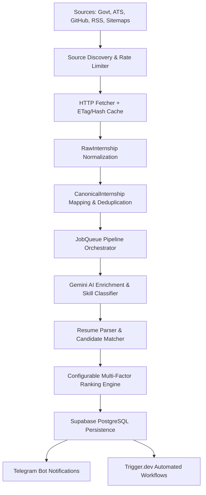

# Atlas InternAI 🚀

> **Autonomous, Event-Driven, AI-Powered Internship Intelligence Platform**

Atlas InternAI is an open-source, production-grade autonomous internship intelligence system built with Node.js, TypeScript, Trigger.dev v4, Google Gemini API (Free Tier), and Supabase PostgreSQL.

---

## 🌟 Key Features

- 🤖 **Autonomous Multi-Source Discovery**: Continuously collects internship listings from Government schemes (AICTE, ISRO, DRDO, NITI Aayog, MeitY, NIC, CDAC, BARC), tech ATS portals (Greenhouse, Lever, Ashby), GitHub repos, RSS feeds, and XML Sitemaps.
- ⚡ **Zero-Budget Architecture**: 100% functional on free-tier infrastructure (Supabase PostgreSQL, Gemini API free tier, Trigger.dev v4).
- 🧹 **Canonical Data Pipeline & Fast Deduplication**: Decoupled 4-stage pipeline (`CollectedPage` -> `RawInternship` -> `CanonicalInternship` -> `Database Entity`) with canonical URL normalization & MD5 content fingerprinting.
- 🎯 **Dynamic Weighted Ranking**: Configurable multi-factor scoring formula balancing resume match, company prestige, career growth potential, deadline urgency, and stipend levels.
- 📑 **Multi-Format Resume Parser**: Automatically extracts technical skills and project domain experience from PDF, DOCX, Markdown, and TXT resume files.
- 📱 **Telegram Notifications**: Real-time rich Markdown alerts with `⚠️ Low Confidence` indicator badges for AI fallback verification.
- 🔄 **Trigger.dev Orchestration**: Background tasks for source health checks, crawling, pipeline processing, daily digests, and deadline warnings.

---

## 🏗 System Architecture



---

## 🚀 Quick Start

### 1. Prerequisites
- **Node.js**: v22+
- **pnpm**: v9+
- **Supabase Account**: Free tier PostgreSQL database
- **Gemini API Key**: Free tier API key from Google AI Studio

### 2. Installation & Setup
```bash
# Clone the repository
git clone https://github.com/atlas-intern-ai/atlas-intern-ai.git
cd atlas-intern-ai

# Install dependencies
pnpm install

# Copy environment template
cp .env.example .env
```

### 3. Environment Configuration (`.env`)
Fill in your credentials in `.env`:
```env
GEMINI_API_KEY=your_gemini_api_key
SUPABASE_URL=https://your-supabase.supabase.co
SUPABASE_SERVICE_ROLE_KEY=your_service_role_key
TRIGGER_SECRET_KEY=tr_dev_your_trigger_key
TELEGRAM_BOT_TOKEN=your_telegram_bot_token
TELEGRAM_CHAT_ID=your_chat_id
USER_RESUME_PATH=./data/resume.pdf
```

### 4. Database Setup
Run the SQL DDL script in your Supabase SQL Editor:
`src/database/schema.sql`

### 5. Running the Application
```bash
# Build TypeScript
pnpm build

# Run unit tests
pnpm test

# Run local dev server
pnpm dev
```

---

## 📚 Documentation

Detailed documentation is available in the `docs/` folder:
- 📑 [Architecture Guide](docs/ARCHITECTURE.md)
- 🗄 [Database Schema](docs/DATABASE_SCHEMA.md)
- 💻 [Developer Guide](docs/DEVELOPER_GUIDE.md)
- 🚀 [Deployment Guide](docs/DEPLOYMENT_GUIDE.md)

---

## 📄 License
MIT License. Created by Atlas InternAI Team.
